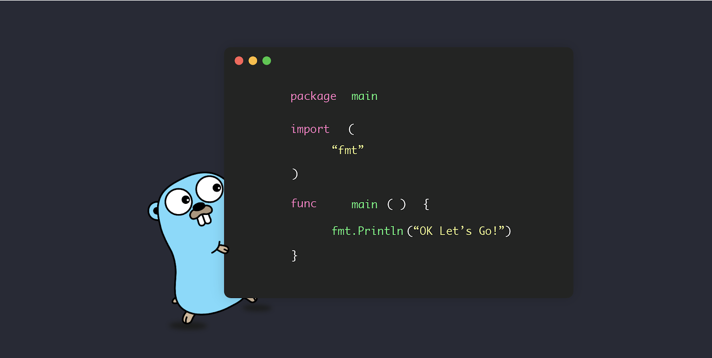

# OK Let’s Go: Three Approaches to Structuring Go Code

This repository contains the structures of the approaches detailed in the article.
If you found any issues in this repository, feel free to open an issue or comment in the article page.
